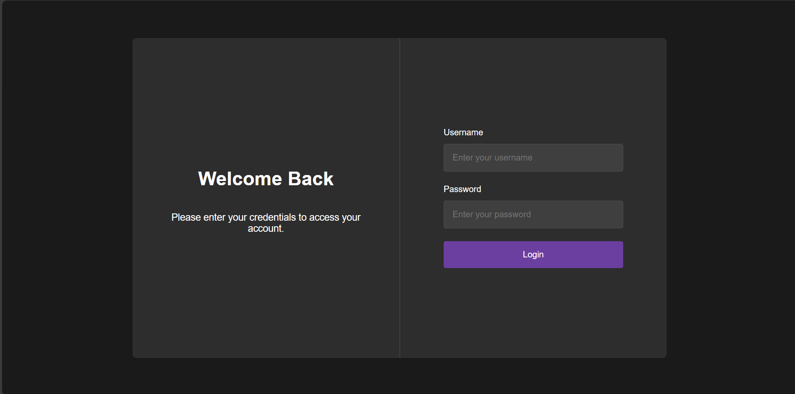
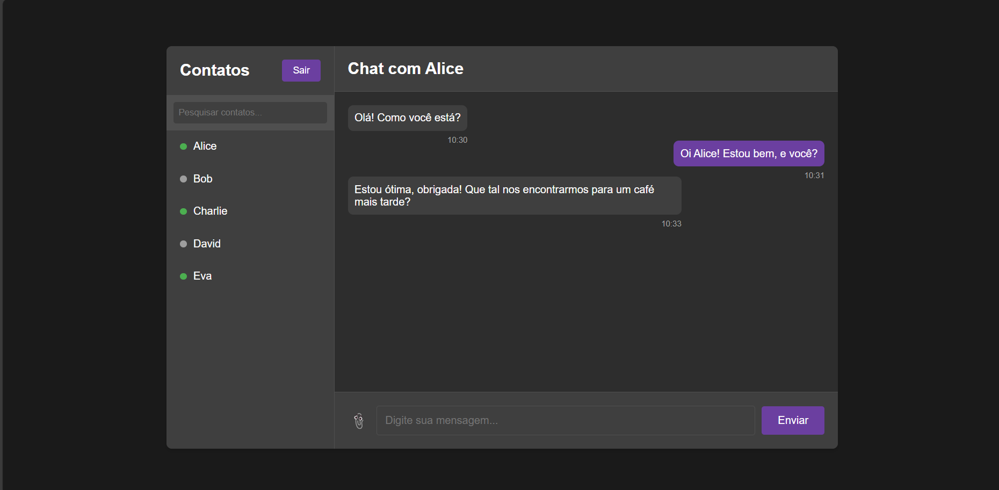

# Front-End do Projeto de Chat Online 👩‍💻

Este repositório contém o front-end de um aplicativo de chat simples, desenvolvido com **HTML5**, **CSS3**, e **JavaScript**, projetado para funcionar com um back-end em **Spring WebSocket**.

## Funcionalidades ⚒️

- Interface de usuário minimalista e intuitiva.
- Envio e recebimento de mensagens em tempo real via WebSocket.
- Campos para inserção de nome do usuário e envio de mensagens.

## Tecnologias Utilizadas 💻

- **HTML5**: Estruturação das páginas.
- **CSS3**: Estilização das telas e layout.
- **JavaScript**: Gerenciamento de eventos, comunicação via WebSocket e manipulação do DOM.

## Como Executar o Front-End 🤔

1. **Clonar o repositório:**

   ```
   bash
   git clone https://github.com/euvitorti/chatFront.git
   cd nome-do-repositorio-front
   ```

2. Executar o projeto:

   Não é necessário nenhum servidor para rodar o front-end, basta abrir o arquivo index.html no navegador.

3. Conectar ao back-end:

   Certifique-se de que o [servidor WebSocket do back-end (desenvolvido com Spring Boot)](https://github.com/euvitorti/chatonline) esteja em execução. As mensagens serão enviadas e recebidas conforme os usuários interagem no chat.

## Exemplo de Uso

Aqui estão algumas imagens das telas do front-end:

1. Tela de login:

   

2. Tela de troca de mensagens:

   

## Contribuição 🚀

Sinta-se à vontade para abrir issues e enviar pull requests para contribuir com o projeto.
